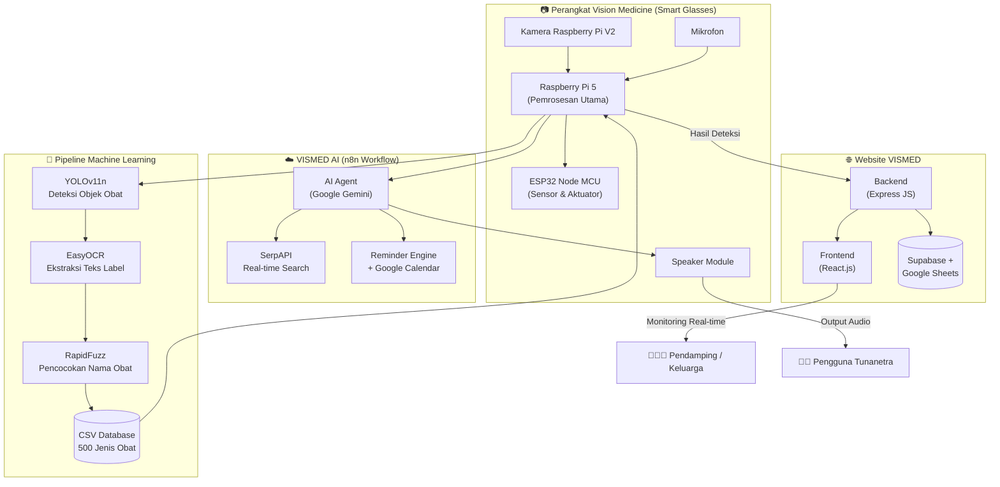
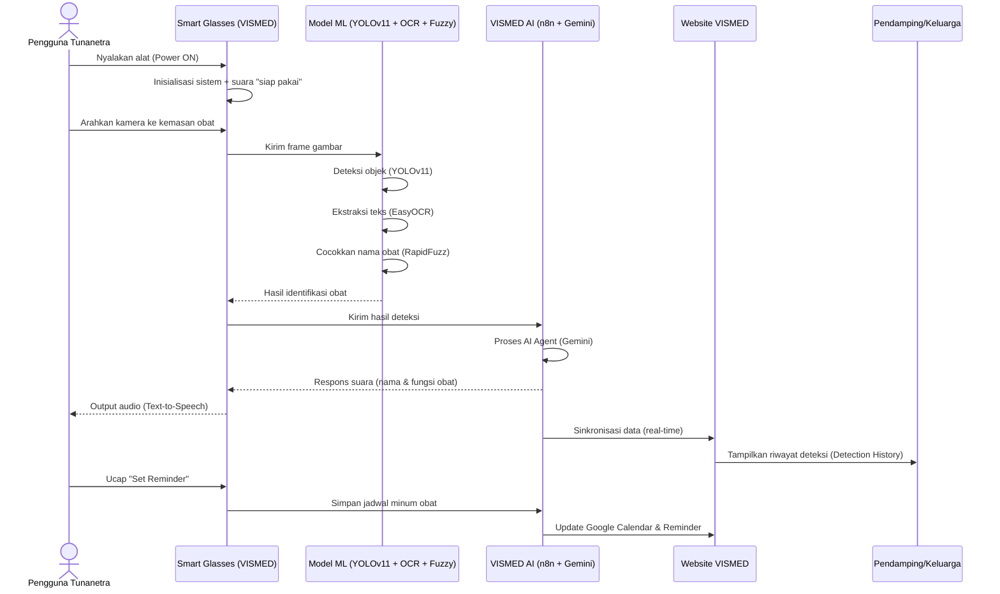

<div align="center">


# 👓 VISION MEDICINE
### Smart Glasses Berbasis *Machine Learning* untuk Deteksi Obat Bagi Penyandang Tunanetra dengan *Generative AI* dan *Voice Assistant*

**Program Kreativitas Mahasiswa – Karsa Cipta (PKM-KC) 2025**
**Universitas Muhammadiyah Malang**

[](https://github.com/alfitranurr/VISION-MEDICINE)
[](https://belmawa.kemdikbud.go.id/)
[](https://vision-medicine.vercel.app/)
[](#-lisensi)

[Website](https://vision-medicine.vercel.app/) · [Video Demo](https://youtu.be/4JA1UXwaIXg) · [Video Optimisasi](https://youtu.be/eWtP0rLCTGA) · [Laporan Lengkap](#-dokumentasi)

</div>

---

## 📋 Daftar Isi

- [👓 VISION MEDICINE](#-vision-medicine)
    - [Smart Glasses Berbasis *Machine Learning* untuk Deteksi Obat Bagi Penyandang Tunanetra dengan *Generative AI* dan *Voice Assistant*](#smart-glasses-berbasis-machine-learning-untuk-deteksi-obat-bagi-penyandang-tunanetra-dengan-generative-ai-dan-voice-assistant)
  - [📋 Daftar Isi](#-daftar-isi)
  - [🩺 Tentang Proyek](#-tentang-proyek)
  - [👥 Tim Pengembang](#-tim-pengembang)
  - [🏆 Pencapaian \& Sertifikat Penghargaan](#-pencapaian--sertifikat-penghargaan)
  - [🔎 Latar Belakang](#-latar-belakang)
  - [⚖️ Perbandingan dengan Alat Terdahulu](#️-perbandingan-dengan-alat-terdahulu)
  - [✨ Fitur Utama](#-fitur-utama)
  - [🛠️ Tech Stack](#️-tech-stack)
  - [🏗️ Arsitektur Sistem](#️-arsitektur-sistem)
  - [🔄 Alur Kerja (Workflow)](#-alur-kerja-workflow)
  - [📂 Struktur Repository](#-struktur-repository)
  - [🔩 Spesifikasi Perangkat](#-spesifikasi-perangkat)
  - [⚙️ Cara Kerja Alat](#️-cara-kerja-alat)
  - [📊 Hasil \& Evaluasi](#-hasil--evaluasi)
    - [Optimalisasi Sistem: Sebelum vs Sesudah](#optimalisasi-sistem-sebelum-vs-sesudah)
    - [Evaluasi Kombinasi Model (Machine Learning)](#evaluasi-kombinasi-model-machine-learning)
    - [Tautan Video](#tautan-video)
  - [🧾 Potensi Hak Kekayaan Intelektual (HaKI)](#-potensi-hak-kekayaan-intelektual-haki)
  - [📰 Liputan Media](#-liputan-media)
  - [🚀 Instalasi \& Menjalankan Proyek](#-instalasi--menjalankan-proyek)
    - [1. Clone Repository](#1-clone-repository)
    - [2. Menjalankan Model YOLO (Deteksi Obat)](#2-menjalankan-model-yolo-deteksi-obat)
    - [3. Menjalankan Website VISMED](#3-menjalankan-website-vismed)
    - [4. Menjalankan Voice Assistant](#4-menjalankan-voice-assistant)
    - [5. Menjalankan Workflow n8n (VISMED AI)](#5-menjalankan-workflow-n8n-vismed-ai)
  - [🗺️ Roadmap Pengembangan](#️-roadmap-pengembangan)
  - [🎯 Kesimpulan](#-kesimpulan)
  - [📚 Dokumentasi](#-dokumentasi)
  - [📄 Lisensi](#-lisensi)
  - [🙏 Ucapan Terima Kasih](#-ucapan-terima-kasih)

---

## 🩺 Tentang Proyek

**Vision Medicine (VISMED)** adalah *smart glasses* berbasis **Machine Learning** dan **Internet of Things (IoT)** yang dirancang untuk membantu penyandang tunanetra mengenali obat secara **mandiri, akurat, dan real-time**. Sistem ini mengintegrasikan tiga teknologi inti:

- 🔍 **YOLOv11** — deteksi objek kemasan obat (akurasi **99%**)
- 🔤 **EasyOCR** — pembacaan teks pada label obat
- 🧩 **RapidFuzz (Fuzzy String Matching)** — pencocokan nama obat dengan database (akurasi gabungan OCR + Fuzzy **98%**)

Dilengkapi dengan **AI Voice Assistant** dua arah, sistem pengingat jadwal minum obat, serta **website monitoring VISMED** berbasis React & Express JS untuk pendamping/keluarga memantau penggunaan alat secara *real-time*.

> Proyek ini merupakan inovasi pertama yang mengintegrasikan **YOLOv11 + EasyOCR + Fuzzy String Matching** dalam satu perangkat *assistive smart glasses* berbasis AI dan *voice assistant* di bidang kesehatan digital Indonesia.

---

## 👥 Tim Pengembang

Tim Vision Medicine mewakili **Universitas Muhammadiyah Malang (UMM)** dalam Program Kreativitas Mahasiswa Karsa Cipta (PKM-KC) 2025 yang didanai secara nasional oleh Kementerian Pendidikan Tinggi, Sains, dan Teknologi RI, dan turut mengantarkan **UMM ke peringkat 8 nasional** untuk jumlah proposal lolos pendanaan.

| Peran              | Nama                                         | NIM             | Program Studi        |
| ------------------ | -------------------------------------------- | --------------- | -------------------- |
| 👑 Ketua Tim        | **Al Fitra Nur Ramadhani**                   | 202210370311264 | Informatika          |
| 👤 Anggota 1        | **Muhammad Hanif**                           | 202210370311265 | Informatika          |
| 👤 Anggota 2        | **Zaki Hanif Izzet**                         | 202210130311035 | Teknik Elektro       |
| 👤 Anggota 3        | **Riko Dwi Firmansyah**                      | 202210130311020 | Teknik Elektro       |
| 👤 Anggota 4        | **Dwi Sukmawati**                            | 202210410311322 | Farmasi              |
| 🧑‍🏫 Dosen Pembimbing | **Ir. Galih Wasis Wicaksono, S.Kom., M.Cs.** | —               | Dosen Pembimbing PKM |

---

## 🏆 Pencapaian & Sertifikat Penghargaan

Tim Vision Medicine berhasil meraih **3 sertifikat penghargaan** tingkat nasional sepanjang pelaksanaan program:

<table>
<tr>
<td width="33%" align="center">

**🥇 Pendanaan Nasional PKM-KC 2025**
<br/>

<br/>
<sub>Nomor: 5108/B2/DT.01.00/2025 — Direktorat Jenderal Pendidikan Tinggi, Riset, dan Teknologi (Belmawa)</sub>

</td>
<td width="33%" align="center">

**🥇 Juara 1 PKP2 PTMA 2025**
<br/>

<br/>
<sub>Juara 1 Skema PKM-KC (Room 1) — Universitas Muhammadiyah Makassar, 10–11 Oktober 2025</sub>

</td>
<td width="33%" align="center">

**🥈 Juara 2 PIMTANAS ke-5 2025**
<br/>

<br/>
<sub>Juara 2 Kategori Presentasi KC/PI/VGK/GFT — Universitas Muhammadiyah Banjarmasin, 11–13 Desember 2025</sub>

</td>
</tr>
</table>

| No. | Penghargaan                                                | Penyelenggara                   | Tanggal             |
| --- | ---------------------------------------------------------- | ------------------------------- | ------------------- |
| 1   | 🏅 Lolos Pendanaan Nasional PKM-KC 2025                     | Kemendikbudristek – Belmawa     | 4 Desember 2025     |
| 2   | 🥇 Juara 1 Skema PKM-KC (Room 1), Lomba PKP2 PTMA           | PUSPRESMA PTMA & UM Makassar    | 10–11 Oktober 2025  |
| 3   | 🥈 Juara 2 Kategori Presentasi KC/PI/VGK/GFT, PIMTANAS ke-5 | PUSPRESMA PTMA & UM Banjarmasin | 11–13 Desember 2025 |

> 📁 **Catatan implementasi:** letakkan ketiga file gambar sertifikat di dalam folder `assets/certificates/` pada root repository dengan nama file yang sama seperti pada tabel di atas, agar gambar tampil otomatis di halaman GitHub.

---

## 🔎 Latar Belakang

Berdasarkan data **World Health Organization (WHO)**, terdapat sekitar **285 juta** penyandang tunanetra di dunia (246 juta *low vision* dan 39 juta *total blind*). Indonesia sendiri memiliki lebih dari **3,75 juta jiwa (1,5% populasi)** penyandang tunanetra.

Keterbatasan penglihatan ini menimbulkan risiko besar dalam penggunaan obat:

- ⚠️ Lebih dari **50% bahaya terhadap pasien** disebabkan oleh kesalahan penggunaan obat (*medication error*) — WHO, 2024.
- 🧑‍🦯 Penyandang tunanetra kesulitan membedakan nama, warna, dosis, dan petunjuk penyimpanan obat.
- 🔐 Ketergantungan pada orang lain berpotensi melanggar privasi informasi kesehatan yang bersifat sensitif.

**Vision Medicine** hadir sebagai solusi *assistive technology* yang memungkinkan penyandang tunanetra mengenali obat secara **mandiri, cepat, dan akurat**, tanpa harus bergantung pada bantuan orang lain.

---

## ⚖️ Perbandingan dengan Alat Terdahulu

Vision Medicine dikembangkan sebagai penyempurnaan dari **SmarV (Smart Vision)**, inovasi PKM-KC UGM 2024.

| Aspek                  | SmarV (UGM, 2024) | **Vision Medicine (UMM, 2025)**               |
| ---------------------- | ----------------- | --------------------------------------------- |
| Teknologi Deteksi Obat | YOLOv9            | **YOLOv11 + EasyOCR + Fuzzy String Matching** |
| Desain Prototype       | Kotak Portabel    | **Smart Glasses (wearable)**                  |
| Monitoring             | WhatsApp          | **Website (VISMED)**                          |
| Interaksi Komunikasi   | Tidak Ada         | **AI Voice Assistant Dua Arah**               |
| Skalabilitas Dataset   | Terbatas          | **500 jenis obat & terus bertambah**          |

---

## ✨ Fitur Utama

- 🎯 **Deteksi Obat Real-time** — YOLOv11 + EasyOCR + RapidFuzz mengenali nama obat secara instan melalui kamera pada kacamata.
- 🗣️ **AI Voice Assistant** — interaksi dua arah ("Halo VISMED" untuk memulai, "Thank You" untuk keluar), mampu menjawab pertanyaan seputar obat maupun informasi umum.
- ⏰ **Reminder Jadwal Obat** — perintah suara ("Set Reminder") terintegrasi dengan Google Calendar.
- 🌐 **Website Monitoring VISMED** — dashboard real-time bagi pendamping/keluarga untuk memantau riwayat deteksi obat (*Detection History*).
- 🔊 **Text-to-Speech (TTS)** — hasil deteksi dibacakan otomatis secara audio.
- 📶 **Konektivitas IoT** — integrasi Raspberry Pi 5, ESP32, dan workflow otomatisasi berbasis n8n.
- 🩹 **Desain Wearable Ringkas** — dimensi 20 × 8,5 × 8 cm, menyerupai kacamata VR, portabel dan nyaman digunakan.

---

## 🛠️ Tech Stack

<div align="center">

| Kategori                       | Teknologi                                                                                                                                      |
| ------------------------------ | ---------------------------------------------------------------------------------------------------------------------------------------------- |
| **Computer Vision**            |  YOLOv11 (Ultralytics), OpenCV                                |
| **OCR & Text Matching**        | EasyOCR, RapidFuzz (Levenshtein / Jaro-Winkler distance)                                                                                       |
| **Embedded / Hardware**        |  Raspberry Pi 5, ESP32 (Node MCU 38 Pin), Kamera Raspberry Pi V2 |
| **AI Agent / Voice Assistant** | Google Gemini (LLM), n8n Workflow Automation, SerpAPI, Text-to-Speech (TTS)                                                                    |
| **Frontend Website**           |  React.js                                         |
| **Backend Website**            |  Express JS                                       |
| **Database & Storage**         | Supabase, Google Sheets                                                                                                                        |
| **Infrastruktur / Deployment** | Microsoft Azure, Vercel,  Railway (n8n)                       |
| **Desain 3D**                  | Autodesk Inventor                                                                                                                              |

</div>

Distribusi bahasa pemrograman pada repository:

`Python` · `TypeScript` · `C++` · `JavaScript` · `CSS` · `Dockerfile` · `HTML`

---

## 🏗️ Arsitektur Sistem



---

## 🔄 Alur Kerja (Workflow)



---

## 📂 Struktur Repository

```
VISION-MEDICINE/
├── FINAL/               # Kode final terintegrasi (hardware + AI + voice assistant)
├── PROTOTYPE/           # Source code & desain awal prototype smart glasses
├── VISMED AI/           # Workflow n8n, AI Agent (Google Gemini), integrasi Supabase/Sheets
├── VOICE ASSISTANT/     # Modul Text-to-Speech, Speech-to-Text, dan voice interaction
├── WEBSITE/             # Source code website VISMED (React + Express JS)
├── YOLO/                # Dataset, training, dan model YOLOv11 untuk deteksi obat
├── n8n-railway/         # Konfigurasi deployment n8n pada platform Railway
├── assets/
│   ├── certificates/    # Sertifikat penghargaan (lihat bagian Pencapaian)
│   └── logo/            # Logo & banner proyek
└── README.md
```

---

## 🔩 Spesifikasi Perangkat

| Komponen              | Keterangan                                                                                         |
| --------------------- | -------------------------------------------------------------------------------------------------- |
| Prosesor Utama        | Raspberry Pi 5                                                                                     |
| Mikrokontroler Sensor | ESP32 Node MCU 38 Pin                                                                              |
| Kamera                | Raspberry Pi Camera Module V2                                                                      |
| Baterai               | Lithium Polymer 5.000 mAh                                                                          |
| Audio                 | Speaker Module + Mikrofon USB + Amplifier PAM8406                                                  |
| Sensor Tambahan       | HC-SR04 (jarak), GPS, RF 433 MHz                                                                   |
| Dimensi               | 20 × 8,5 × 8 cm                                                                                    |
| Berat                 | ± 790 gram                                                                                         |
| Model Deteksi         | YOLOv11n (80 epoch, batch size 16)                                                                 |
| Dataset Training      | 1.050 gambar (hasil augmentasi dari 350 gambar, 70 jenis obat awal → berkembang menjadi 500 jenis) |

---

## ⚙️ Cara Kerja Alat

1. **Power** — Pengguna menyalakan alat untuk memulai sistem.
2. **Inisialisasi** — Sistem melakukan setup dan memberi suara siap pakai.
3. **Deteksi Obat** — Pengguna mengarahkan obat ke kamera; sistem membacakan informasi obat secara otomatis.
4. **Voice Assistant** — Ucapkan **"Halo VISMED"** untuk memulai percakapan, dan **"Thank You"** untuk mengakhiri.
5. **Reminder** — Ucapkan **"Set Reminder"** untuk mengatur jadwal minum obat.
6. **Website Monitoring** — Pendamping dapat memantau penggunaan alat secara *real-time* melalui [vision-medicine.vercel.app](https://vision-medicine.vercel.app/).

---

## 📊 Hasil & Evaluasi

### Optimalisasi Sistem: Sebelum vs Sesudah

| Aspek Pengembangan                  | Sebelum                  | Sesudah                 |
| ----------------------------------- | ------------------------ | ----------------------- |
| Akurasi YOLOv11                     | 98%                      | **99%**                 |
| Akurasi OCR + Fuzzy String Matching | 89%                      | **98%**                 |
| Kecepatan Pengiriman Data           | 6–7 detik                | **3–4 detik**           |
| Fitur Website                       | Tampilan POV kamera saja | **+ Detection History** |
| Jumlah Responden Uji (Tunanetra)    | 4 orang                  | **6 orang**             |
| Dataset Obat                        | 70 jenis                 | **500 jenis**           |

### Evaluasi Kombinasi Model (Machine Learning)

Model terbaik — **YOLO Default + EasyOCR + RapidFuzz** — mencatatkan performa tertinggi di antara 11 kombinasi model yang diuji:

| Kombinasi Model                         | Accuracy   | Precision  | Recall     | F1-score   |
| --------------------------------------- | ---------- | ---------- | ---------- | ---------- |
| **YOLO Default + EasyOCR + RapidFuzz**  | **98.39%** | **94.03%** | **93.67%** | **93.83%** |
| YOLO Tuned + EasyOCR + RapidFuzz        | 98.21%     | 93.75%     | 93.01%     | 93.33%     |
| YOLO Tuned + EasyOCR + TextDistance     | 97.76%     | 93.75%     | 92.23%     | 92.72%     |
| YOLO Default + TesseractOCR + RapidFuzz | 96.94%     | 92.31%     | 91.79%     | 92.00%     |

*(Tabel lengkap 11 kombinasi model tersedia pada Lampiran 7 Laporan Kemajuan PKM-KC.)*

### Tautan Video

- 🎥 Progress & Pengujian Alat: [youtu.be/4JA1UXwaIXg](https://youtu.be/4JA1UXwaIXg)
- 🎥 Optimalisasi Sistem: [youtu.be/eWtP0rLCTGA](https://youtu.be/eWtP0rLCTGA)

---

## 🧾 Potensi Hak Kekayaan Intelektual (HaKI)

Hasil penelusuran paten menunjukkan bahwa **Vision Medicine tidak memiliki kesamaan struktural maupun fungsional** dengan paten/produk sejenis yang telah ada:

| Nomor Paten Referensi | Fokus Paten                   | Perbedaan dengan Vision Medicine                             |
| --------------------- | ----------------------------- | ------------------------------------------------------------ |
| CN_110599512_A        | OCR Drug Detection            | Tidak menggunakan smart glasses/VR; fokus otomatisasi apotek |
| CN_113947586_A        | YOLO Drug Detection           | Tidak menggunakan EasyOCR, RapidFuzz, atau smart glasses     |
| WO_2022227218_A1      | Fuzzy Matching Drug Detection | Tidak mengintegrasikan smart glasses/VR                      |

Kombinasi **YOLOv11 + EasyOCR + Fuzzy String Matching** dalam satu perangkat *wearable* dengan *Generative AI Voice Assistant* memenuhi kriteria **novelty**, **inventive step**, dan **penerapan teknologi orisinal**, sehingga berpotensi tinggi diajukan sebagai HaKI.

---

## 📰 Liputan Media

Program Vision Medicine telah diliput oleh berbagai media nasional, di antaranya **Lensamu**, **RCTI+**, **Kompas**, serta lebih dari **12 media lainnya**, sebagai bentuk apresiasi terhadap inovasi berbasis *deep learning* untuk aksesibilitas penyandang tunanetra.

---

## 🚀 Instalasi & Menjalankan Proyek

> ⚠️ Proyek ini terdiri dari beberapa modul (embedded system, model ML, website, dan workflow AI) yang berjalan pada lingkungan berbeda. Ikuti langkah sesuai modul yang ingin dijalankan.

### 1. Clone Repository
```bash
git clone https://github.com/alfitranurr/VISION-MEDICINE.git
cd VISION-MEDICINE
```

### 2. Menjalankan Model YOLO (Deteksi Obat)
```bash
cd YOLO
pip install -r requirements.txt
python detect.py --weights best.pt --source 0
```

### 3. Menjalankan Website VISMED
```bash
cd WEBSITE
npm install
npm run dev
```

### 4. Menjalankan Voice Assistant
```bash
cd "VOICE ASSISTANT"
pip install -r requirements.txt
python main.py
```

### 5. Menjalankan Workflow n8n (VISMED AI)
```bash
cd n8n-railway
docker compose up -d
```

> 📌 Sesuaikan file konfigurasi (`.env`) pada masing-masing folder dengan kredensial API Key (Google Gemini, SerpAPI, Supabase) milik Anda sebelum menjalankan sistem.

---

## 🗺️ Roadmap Pengembangan

- [ ] Penyempurnaan deteksi obat dalam kondisi cahaya redup/minim
- [ ] Pengurangan berat alat (saat ini ± 790 gram) agar lebih ringan digunakan
- [ ] Optimalisasi daya baterai untuk durasi pemakaian > 1 jam
- [ ] Kolaborasi lanjutan dengan lembaga kesehatan & yayasan tunanetra
- [ ] Pengajuan resmi Hak Kekayaan Intelektual (HaKI)
- [ ] Ekspansi dataset obat & potensi komersialisasi produk

---

## 🎯 Kesimpulan

Vision Medicine berhasil menghasilkan *prototype* fungsional yang mampu mendeteksi nama obat secara *real-time* melalui integrasi **YOLOv11**, **EasyOCR**, dan **Fuzzy String Matching**, didukung **AI Voice Assistant** yang interaktif serta **website monitoring** yang terintegrasi. Produk ini telah diuji bersama dosen pembimbing, dokter, dan pengguna tunanetra langsung, serta memperoleh pengakuan pada tiga ajang nasional berbeda. Vision Medicine memberikan solusi nyata untuk meningkatkan **kemandirian, keamanan, dan privasi** penyandang tunanetra dalam mengonsumsi obat, dengan potensi besar untuk dikembangkan lebih lanjut ke tahap komersialisasi dan perlindungan hukum kekayaan intelektual.

---

## 📚 Dokumentasi

- 📄 Proposal & Laporan Kemajuan PKM-KC 2025 (lengkap dengan lampiran penggunaan dana, bukti kegiatan, dan evaluasi model)
- 🌐 Website: [vision-medicine.vercel.app](https://vision-medicine.vercel.app/)
- 🗂️ Dataset Informasi Obat (Google Sheets — 500 jenis obat)
- 📖 Buku Panduan Penggunaan Vision Medicine

---

## 📄 Lisensi

Proyek ini dikembangkan untuk keperluan akademik dalam rangka **Program Kreativitas Mahasiswa (PKM) Karsa Cipta 2025**, didanai oleh **Direktorat Jenderal Pendidikan Tinggi, Riset, dan Teknologi, Kemendikbudristek RI**. Penggunaan lebih lanjut untuk tujuan komersial mengikuti proses pengajuan Hak Kekayaan Intelektual (HaKI) yang sedang diupayakan oleh tim.

---

## 🙏 Ucapan Terima Kasih

Tim Vision Medicine mengucapkan terima kasih kepada:

- **Ir. Galih Wasis Wicaksono, S.Kom., M.Cs.** selaku Dosen Pembimbing
- **Universitas Muhammadiyah Malang (UMM)** dan **UMM Medical Center**
- **Direktorat Jenderal Pendidikan Tinggi, Riset, dan Teknologi (Belmawa)**
- Seluruh dokter, dosen, dan penyandang tunanetra yang telah berkontribusi dalam proses pengujian alat
- **Yayasan Tunanetra** atas kerja sama dan dukungan pengujian lapangan

<div align="center">

---

**© 2025 Tim Vision Medicine — Universitas Muhammadiyah Malang**

*Dibuat dengan ❤️ untuk kemandirian dan keselamatan penyandang tunanetra Indonesia*

</div>